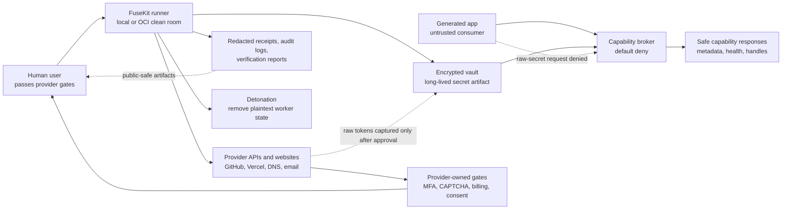

# Threat Model

FuseKit is a setup worker and encrypted capability vault for AI-built apps. It
handles real secrets while configuring real providers, then preserves encrypted
artifacts and removes plaintext worker state.

## Assets

- provider tokens and OAuth/session material
- account credentials entered or created during setup
- API keys, webhook secrets, SSH private keys, DNS tokens, database credentials,
  and deployment secrets
- vault passphrase while in use
- generated app source and provider configuration
- redacted receipts, audit logs, and acceptance reports

## Security Goals

- Raw secrets do not enter generated app source files.
- Raw secrets do not appear in receipts, audit logs, terminal summaries, or
  acceptance artifacts.
- The vault file is unintelligible without the passphrase.
- Wrong passphrases fail.
- Provider tokens are routed only to allowed provider/setup paths.
- Temporary worker state is removed after setup unless explicitly retained for
  debugging.
- Human/provider gates are waited on, not bypassed.

## Non-Goals

- FuseKit does not bypass CAPTCHA, MFA, passkeys, fraud checks, payment
  verification, or provider consent screens.
- FuseKit does not export browser password managers.
- FuseKit does not make provider guarantees stronger than the provider's own
  APIs and authorization model.
- FuseKit does not protect secrets after a user intentionally copies them into
  another system outside FuseKit's control.

## Trust Boundaries

- Generated apps are untrusted consumers. They may request capabilities, but
  must not receive raw secrets.
- Provider websites and APIs are external systems. FuseKit can guide setup and
  verify outcomes, but service-side gates remain provider-controlled.
- The local or OCI runner is temporary worker infrastructure. It may hold
  plaintext secrets while unlocked, and must be detonated after setup.
- The encrypted vault is the long-lived secret artifact.
- Receipts, audit logs, launcher files, and acceptance reports are public by
  default and must be redacted.

## Safety Model

The central boundary is between the unlocked runner and everything that can
outlive the setup run. Secrets may be present only inside the active runner or
encrypted vault. Generated apps, receipts, audits, prompts, screenshots,
launcher files, and acceptance artifacts receive redacted metadata or safe
capability responses.

## Main Risks

- secret leakage through generated files, logs, receipts, screenshots, command
  arguments, or crash output
- LLM-generated provider packs sending secrets to untrusted endpoints
- overbroad wildcard env-secret routing
- stale browser/session state left after provider setup
- rollback metadata that cannot revoke/delete provider resources
- users force-adding ignored `.fusekit` artifacts to a public repository

## Controls

- passphrase-protected vault using memory-hard KDF and authenticated encryption
- capability broker denial of raw secret export
- redaction utilities for receipts and audits
- secret-route classification and provider-pack validation
- endpoint-purpose validation for secret-bearing HTTP checks
- leak scanner for app trees and artifacts
- `.gitignore` rules for vaults, receipts, audit logs, private keys, and local
  env files
- runner detonation for local/remote worker state
- tests for wrong-passphrase behavior, redaction, secret routing, and leak scans

## Residual Risk

FuseKit is powerful because it can configure real accounts and services. Users
should run live acceptance paths with disposable accounts/domains first, review
receipts, and rotate provider credentials after high-risk tests. Managed
enterprise deployments should add org policy, central audit review, and
provider-specific least-privilege templates.
